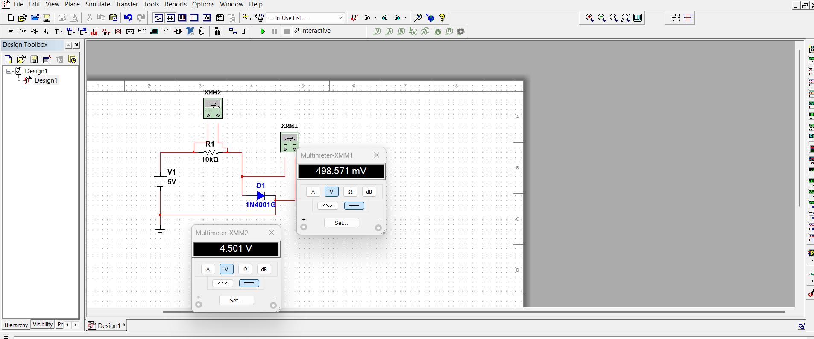

# ⚡ Diode I–V Characterization & Modeling

Personal project exploring forward I–V characteristics of a silicon rectifier diode (1N4001). Includes simulation, bench measurements, parameter extraction, and comparison to the Shockley model.

## 🧭 Overview
- Designed a simple diode test fixture (1N4001 + 10 kΩ)
- Simulated the circuit and swept 0–5 V
- Measured on bench; extracted **VT ≈ 47.6 mV** and **IS ≈ 4.3 nA**
- Compared experiment vs. simulation; results matched within expected tolerances

## 🧰 Tools & Components
- **Diode:** 1N4001 • **Resistor:** 10 kΩ • **Source:** 0–5 V DC  
- **EDA:** Multisim • **Bench:** PSU, DMM, breadboard  
- **Data:** Excel / Power BI (summary)

## ⚡ Circuit (Simulation)

## 📈 Results Snapshot
| VS (V) | VD (V) | VR (V) | ID (mA) |
|--------|--------|--------|---------|
| 5.00   | 0.55   | 4.44   | 0.442   |
| …      | …      | …      | …       |

- Forward knee ~0.5–0.55 V
- Extracted **Shockley params**: VT, IS (see `data/` and `report/`)

## 🧪 Bench Setup

## 📁 Repo Layout
